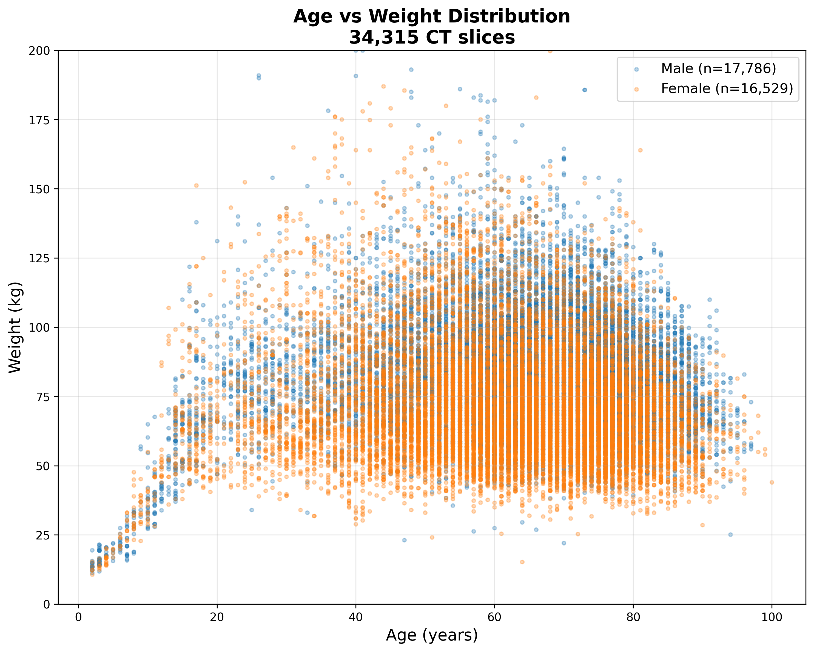
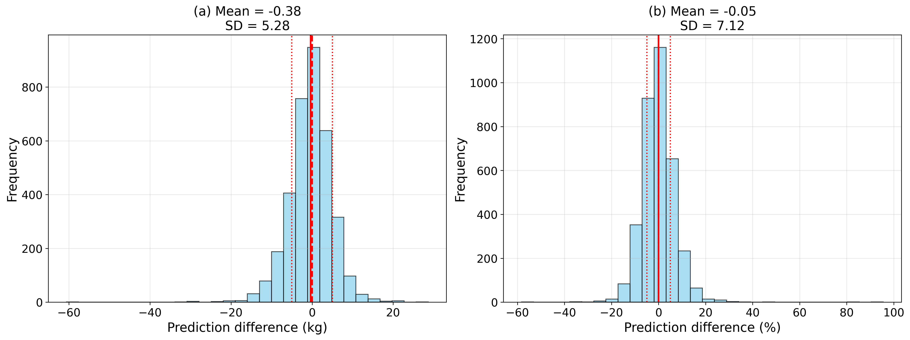
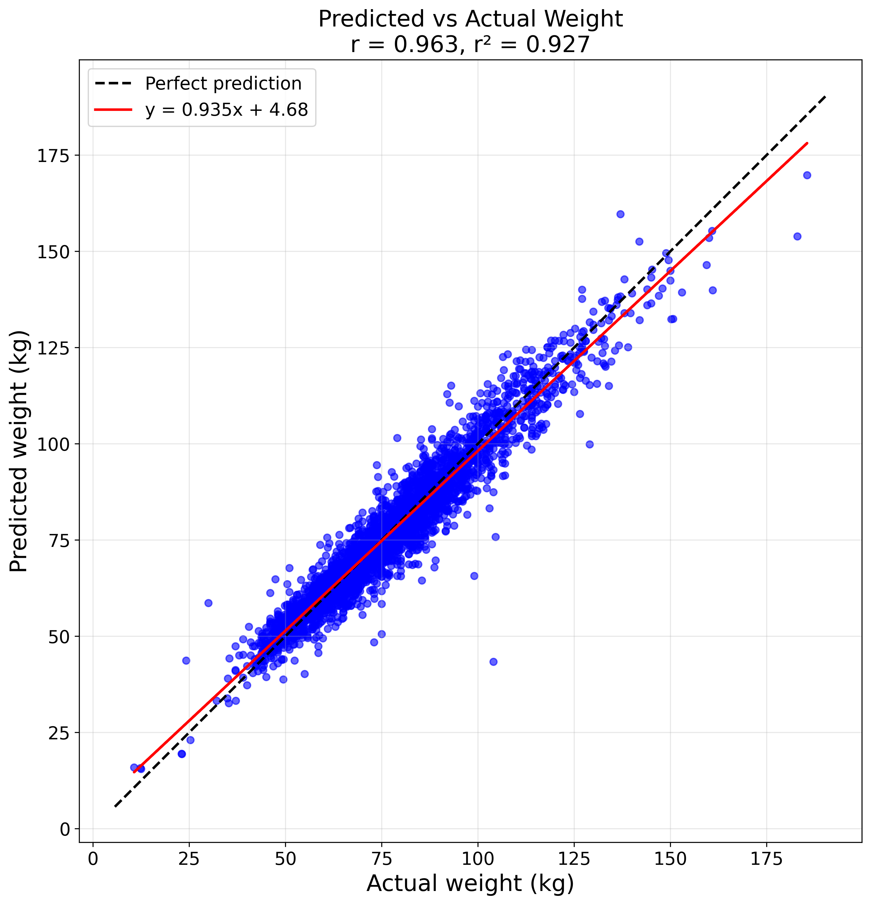
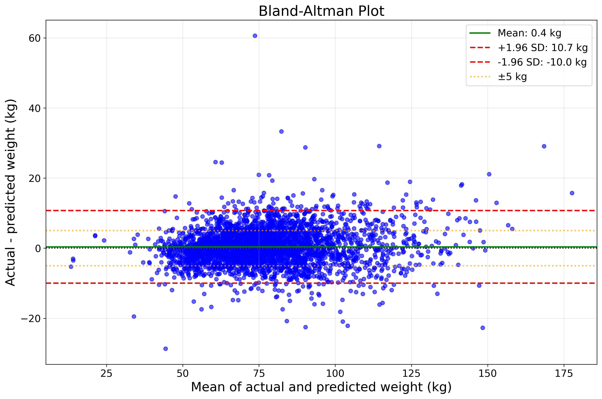

# Deep Learning for Patient Weight Prediction from CT Images
## World Congress Presentation - 12 Minutes

---

## Slide 1: Title (30 sec)
**Automated Patient Weight Prediction from CT Images Using Deep Learning with CT-Derived Body Composition Metrics**

Daniel Carrion¹, Stanley Norris¹, Mohamed Badawy¹  
¹Medical Physics Department  
Monash Health, Melbourne, Australia  

World Congress 2025

---

## Slide 2: Clinical Motivation (1 min)
### Why Predict Weight from CT Images?

**Critical Clinical Need:**
- Accurate weight essential for radiation dose, contrast agent dosing, treatment planning
- 20-30% of patients lack recorded weight
- Emergency/trauma patients often not weighed
- Manual estimates often inaccurate (±10-15kg)

**Our Goal:** Can we estimate weight using novel deep learning approaches that combine image and tabular features?

---

## Slide 3: Previous Research & Our Innovation (1.5 min)
### Learning from Published Studies

**Key Finding from Ichikawa 2024:**
- Best model (1.99 kg MAE) used **NO images** - only 11 tabular dose metrics
- Used 441 slices per patient for full-body WED/ED calculation
- Water Equivalent Diameter (WED) was most predictive

**Our Enhanced Approach:**
- Combine CNN features (ResNet18) + CT metrics + organ segmentation
- Works with **middle slices** (1-2 per patient) typical in clinical practice
- Middle slice selection ensures consistent anatomical regions
- Images resized to 224×224 to leverage ImageNet pre-training
- 19 total features: WED, ED, area, mean HU, age, sex, dose metrics, + 10 organ areas

---

## Slide 4: Dataset Characteristics (1 min)
### Large-Scale Clinical Dataset



**Dataset Overview:**
- **34,318 CT slices** from **17,960 unique patients** (avg 1.9 slices/patient)
- **131 unique scan protocols** from multiple sites
- **Demographics:** 51.8% male, 48.2% female
- **Weight:** Males 81.7±19.5 kg, Females 72.3±20.7 kg (range: 10.7-363.9 kg)
- **Age:** 63.3 ± 15.7 years (range: 2-100 years, includes pediatric)

**Key Features:**
- Real-world clinical diversity vs controlled research datasets
- Oncology population (peak 60-70 years) with pediatric cases

---

## Slide 5: Methods - Architecture (1 min)
### Deep Learning with Feature Fusion

```
                    ResNet18 Path:
CT Slice (224×224) → ResNet18 → 512 features → Neural Network → Weight₁
                                      ↓
                               19 Tabular Features

                    LightGBM Path:
19 Tabular Features → LightGBM → Weight₂

                    Ensemble:
Weight₁ × 0.84 + Weight₂ × 0.16 → Final Weight (kg)
```

**Model Components:**
- **ResNet18**: Convolutional neural network for image feature extraction
  - Pre-trained on ImageNet, fine-tuned on 224×224 CT images
  - Extracts 512 deep features from CT slice patterns
- **LightGBM**: Gradient boosting model for tabular data
  - Handles 19 engineered features efficiently
  - Used in ensemble with ResNet18 (84%/16% weighting)

**Feature Engineering:**
- **Organ segmentation**: Simple HU thresholding to identify 10 organ regions
- **Physics metrics**: WED, ED calculated from CT dose parameters
- **Middle slices only** - consistent anatomical coverage
- Patient-level train/val/test splits (no data leakage)
- Heavier population than Ichikawa (77.2 vs 57.8 kg mean)

---

## Slide 6: Results - Model Performance (1 min)
### Performance Comparison

| Model | Features | Val MAE | 
|-------|----------|---------|
| CatBoost | 19 tabular only | 5.21 kg |
| LightGBM | 19 tabular only | 5.17 kg |
| ResNet18 | Image + 19 features | 3.95 kg |
| **ResNet18 + LightGBM** | **Ensemble (84%/16%)** | **3.89 kg** |
| **Ichikawa 2024** | **11 tabular (441 slices)** | **1.99 kg** |

**Key Finding:** CNN + tabular features outperforms tabular-only by 24%

---

## Slide 7: Error Distribution Analysis (1.5 min)
### Understanding Model Performance



- **Left**: Absolute errors (kg) - 71.4% within ±5 kg threshold
- **Right**: Percentage errors - 88% within ±10% relative error
- Both distributions centered near zero (minimal bias)
- Clinically acceptable for dose calculations

---

## Slide 8: Prediction Accuracy (1 min)
### Scatter Plot & Clinical Agreement



- R² = 0.927 (excellent correlation)
- Consistent performance across weight range (15-170 kg)
- No systematic over/underestimation

---

## Slide 9: Bland-Altman Analysis (1 min)
### Clinical Agreement Assessment



- Mean difference: 0.4 kg
- 95% limits of agreement: -10.0 to +10.7 kg
- Comparable to Ichikawa despite using only 1-2 slices vs 441
- No trend with patient weight

---

## Slide 10: Key Insights & Clinical Impact (1.5 min)
### What We Learned

**Key Findings:**
- Physics-based features (WED, ED) are most predictive
- Image features add value beyond tabular metrics alone
- Limited slice coverage is both limitation AND strength

**Limited Middle Slices: Constraint Became Advantage:**
- **Initial constraint:** Compute limitations forced us to use 1-2 middle slices only
- **Performance impact:** 3.89 kg MAE vs Ichikawa's 1.99 kg (with 441 slices)
- **Unexpected benefit:** Matches clinical reality - most patients lack full-body coverage
- **Middle slice advantage:** Consistent anatomical region (abdomen/pelvis) across patients

**Clinical Applications:**
- Emergency/trauma patients
- Pediatric imaging  
- Routine clinical workflow (no additional scanning required)

---

## Slide 11: Conclusions (1 min)
### Take-Home Messages

✅ **Combining CNN image features with tabular data outperforms either alone**

✅ **Ensemble approach (ResNet18 + LightGBM) achieves 3.89 kg MAE**

✅ **71% of predictions within ±5 kg clinical threshold**

✅ **Compute constraints led to clinically relevant solution (middle slices only)**

✅ **Future work: Multi-slice fusion, prospective validation, real-time deployment**

---

## Slide 12: References

1. Ichikawa H, Ichikawa S, Sawane Y. Machine learning-based estimation of patient body weight from radiation dose metrics in computed tomography. J Appl Clin Med Phys. 2024;25:e14467.

2. Ichikawa S, Hamada M, Sugimori H. A deep-learning method using computed tomography scout images for estimating patient body weight. Sci Rep. 2021;11(1):15627.

3. Demircioglu A, et al. Determining body height and weight from thoracic and abdominal CT localizers using deep learning. Sci Rep. 2023;13:15189.

4. Geraghty EM, Boone JM. Determination of height, weight, body mass index from a single abdominal CT image. Radiology. 2003;228:857-863.

5. Gascho D, et al. A new method for estimating patient body weight using CT dose modulation data. Eur Radiol Exp. 2017;1(1):23.

---

## Slide 13: Thank You

**Thank you for your attention!**

**Questions?**

**Contact:**  
Daniel Carrion: daniel.carrion@monashhealth.org  

